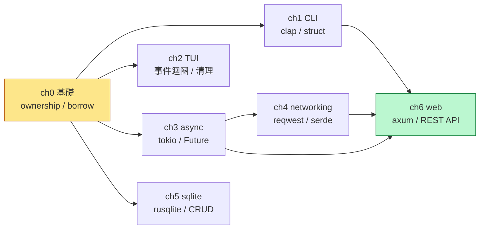

# 📖 Rust 入門教程（給 Python 開發者）

> **一句話簡介**：如果你會 Python，這份教程會用「Python 對照」的方式，帶你從零入門 Rust，一路寫到能跑的 CLI、TUI、網路程式、資料庫與 Web API。

---

## 🗺️ 如何使用本教程

1. **依序閱讀**：從「第 0 章」開始，每章都建立在前一章的觀念上（見下方[學習路徑](#-學習路徑)）。
2. **邊讀邊跑**：每章都是一個獨立的 Cargo crate，看到程式碼就 `cargo run` 跑一次，動手比只讀更有效。
3. **對照 Python**：每章都有「Python 對照」段落，幫你把已有的 Python 知識遷移到 Rust。
4. **做練習**：每章結尾有「練習（選做）」，動手改 code 才是真正的學習。

> 📌 **前置需求**：先安裝 Rust 工具鏈
> ```bash
> curl --proto '=https' --tlsv1.2 -sSf https://sh.rustup.rs | sh
> cargo --version   # 確認安裝成功
> ```

---

## 📚 目錄

本教程共 7 章，從基礎語法到完整 Web API，循序漸進：

| 章 | 標題 | 你會學到什麼 | 難度 | 需網路 |
|----|------|-------------|:----:|:------:|
| [0](chapters/ch00-basics/README.md) | **Rust 基礎** | ownership / borrowing / 型別 / 錯誤處理 / struct / enum / match | ⭐ | ❌ |
| [1](chapters/ch01-cli/README.md) | **CLI 工具（clap）** | 用 clap derive 寫 Todo CLI，子命令與參數解析 | ⭐ | ❌ |
| [2](chapters/ch02-tui/README.md) | **終端介面（ratatui）** | 事件迴圈、raw mode、widget 渲染、資源清理 | ⭐⭐ | ❌ |
| [3](chapters/ch03-async/README.md) | **非同步（tokio）** | async/await、Future、spawn 並發、Send 限制 | ⭐⭐ | ❌ |
| [4](chapters/ch04-networking/README.md) | **網路程式（reqwest）** | HTTP GET/POST、serde JSON 強型別解析 | ⭐⭐ | ✅ |
| [5](chapters/ch05-sqlite/README.md) | **SQLite（rusqlite）** | 資料庫 CRUD、params! 防注入、同步 vs 非同步 | ⭐⭐ | ❌ |
| [6](chapters/ch06-web/README.md) | **Web 開發（axum）** | REST API、Router、Extractor、Arc\<Mutex\> 共用狀態 | ⭐⭐⭐ | ❌ |

> **難度**：⭐ 入門 → ⭐⭐ 進階 → ⭐⭐⭐ 壓軸整合

---

## 🧭 學習路徑

章節之間有觀念上的先後依賴。建議照下面的順序走，不要跳過 ch00：

```
ch00 基礎 ──► ch01 CLI ──► ch02 TUI ──┐
                                       │
                       ch03 async ─────┼──► ch04 networking ──┐
                                       │                        │
                       ch05 sqlite ────┘                        │
                                                                ▼
                                                        ch06 web（壓軸）
```

### 為什麼是這個順序？

- **ch00 先讀**：ownership / borrowing 是 Python 開發者最大的門檻，後面每一章都會用到。
- **ch01 → ch02**：CLI 最簡單（不需 async）；TUI 同步事件迴圈，視覺回饋強，建立信心。
- **ch03 在 ch04 / ch06 之前**：reqwest 與 axum 都是 async，必須先懂 tokio。
- **ch06 最後**：壓軸章整合 async + serde + REST，是前面所學的總驗收。
- **ch05 獨立**：rusqlite 是同步的，與 ch04 平行，任何時間點讀皆可。

### 兩條推薦路線

| 路線 | 順序 | 適合誰 |
|------|------|--------|
| **穩紮穩打**（推薦） | 0 → 1 → 2 → 3 → 4 → 5 → 6 | 第一次學 Rust |
| **快速到 Web** | 0 → 1 → 3 → 4 → 6 | 急著想看到 Web API 跑起來 |

---

## 🚀 快速開始

```bash
# 複製專案後，任選一章執行：
cargo run -p ch00-basics          # 印出 7 段基礎示範
cargo run -p ch01-cli -- add "買牛奶"   # CLI 新增待辦
cargo run -p ch02-tui             # 互動式計數器（按 ↑↓ 操作，q 離開）
cargo run -p ch03-async           # 觀察循序 vs 並發耗時
cargo run -p ch04-networking      # 抓取網路 JSON（需連線）
cargo run -p ch05-sqlite          # 記憶體 SQLite CRUD
cargo run -p ch06-web             # 啟動 REST API 伺服器 (http://localhost:3000)
```

> 也可以進入單章目錄直接 `cargo run`：
> ```bash
> cd chapters/ch01-cli && cargo run -- add "買牛奶"
> ```

---

## 📖 各章簡介

### [第 0 章：Rust 基礎（給 Python 開發者）](chapters/ch00-basics/README.md)

> 學習目標：理解 ownership / borrowing、型別系統、錯誤處理

Rust 與 Python 最關鍵的差異就在 **ownership（所有權）**。本章用 7 段程式碼示範
變數可變性、基本型別、函數、所有權轉移 / 借用、`Result` 錯誤處理、struct / enum、
pattern matching，每段都附 Python 對照。

- 🔑 核心觀念：ownership 三規則、`Result` 取代例外、預設不可變
- 🏃 執行：`cargo run -p ch00-basics`
- ✏️ 練習：寫一個計算 `Vec` 平均值、回傳 `Option<f64>` 的函數

---

### [第 1 章：CLI 工具（clap）](chapters/ch01-cli/README.md)

> 學習目標：用 clap derive 建立 CLI，理解參數解析模式

用 `#[derive(Parser)]` 把 struct 欄位定義直接變成命令列介面。本章實作一個 Todo CLI
（`add` / `list` / `done` 三個子命令），並對照 Python `argparse`。

- 🔑 核心觀念：derive API、子命令用 enum、位置參數 vs 旗標
- 🏃 執行：`cargo run -p ch01-cli -- add "買牛奶"`
- ⚠️ Python 注意：`name: String` 是**位置參數**不是 `--name`
- ✏️ 練習：加一個 `Remove { id: u32 }` 子命令

---

### [第 2 章：終端介面（ratatui）](chapters/ch02-tui/README.md)

> 學習目標：用 ratatui 繪製 TUI，理解事件迴圈與資源清理

做一個互動式計數器：按 ↑/k 加一、↓/j 減一、q 離開。你會學到 raw mode、
alternate screen、widget 渲染，以及「終端是有限狀態資源，一定要清理」的鐵律。

- 🔑 核心觀念：raw mode / alternate screen、事件迴圈、`frame.area()`、清理保證
- 🏃 執行：`cargo run -p ch02-tui`（按 ↑↓ 操作，q 離開）
- ⚠️ Python 注意：panic 在 raw mode 會讓 shell「壞掉」，不像 Python 有 GC / finally
- ✏️ 練習：加 `r` 鍵重置計數器為 0

---

### [第 3 章：非同步程式設計（tokio）](chapters/ch03-async/README.md)

> 學習目標：理解 async/await 與 Future，用 tokio 做並發

用同一個 task 比較「循序執行（≈2 秒）」與「並發執行（≈1 秒）」的耗時差異，
親眼看見 `tokio::spawn` 的並發威力。語法上與 `asyncio` 相似，但 `Send` 限制是關鍵差別。

- 🔑 核心觀念：`async fn` 回傳 Future、`.await` 驅動、`spawn` 並發、`Send` 限制
- 🏃 執行：`cargo run -p ch03-async`（觀察耗時：循序 2s / 並發 1s）
- ⚠️ Python 注意：`tokio::spawn` 要求 `Send`，Python `asyncio.create_task` 無此限制
- ✏️ 練習：spawn 5 個 task 各 sleep 500ms，確認總耗時 ≈500ms

---

### [第 4 章：網路程式設計（reqwest）](chapters/ch04-networking/README.md)

> 學習目標：發 HTTP 請求，用 serde 解析 JSON

從公開 API 抓取 JSON 並剖析成 Rust struct，再示範發 POST。你會看到 Rust 的
`resp.json::<T>()` 比 Python 的 `resp.json()`（回傳 dict）更安全——結構在編譯期就定下來。

- 🔑 核心觀念：async-only reqwest、Client 重用、serde 強型別、`error_for_status`
- 🏃 執行：`cargo run -p ch04-networking`（需網路連線）
- ⚠️ Python 注意：`resp.json()` 在 Python 回 dict，在 Rust 要指定型別 `resp.json::<T>()`
- ✏️ 練習：抓取 `/todos` 列表，用 `Vec<Todo>` 反序列化

---

### [第 5 章：SQLite 資料庫（rusqlite）](chapters/ch05-sqlite/README.md)

> 學習目標：用 rusqlite 操作 SQLite，理解資料庫存取

用 `rusqlite`（`bundled` feature，免系統安裝）對記憶體資料庫做完整 CRUD。
API 與 Python `sqlite3` 高度對應，`params![]` 防注入、`query_map` 把列轉成 struct。

- 🔑 核心觀念：open / execute / query_map、`params!` 防注入、同步特性
- 🏃 執行：`cargo run -p ch05-sqlite`（觀察新增 / 查詢 / 更新 / 再查詢）
- ⚠️ Python 注意：rusqlite 同步阻塞，在 async handler 要用 `spawn_blocking` 或 sqlx
- ✏️ 練習：加一個 DELETE 操作刪除已完成的 todo

---

### [第 6 章：Web 開發（axum）](chapters/ch06-web/README.md)

> 學習目標：用 axum 建 REST API，整合 async + serde

壓軸章！用 axum 打造一個完整的 Todo REST API（GET / POST / PUT / DELETE），
整合前面所學的 tokio（async）、serde（JSON）、並用 `Arc<Mutex<T>>` 管理共用狀態。

- 🔑 核心觀念：Router + method chain、Extractor（State/Path/Json）、`Arc<Mutex>`、axum 0.8 `{id}` 語法
- 🏃 執行：`cargo run -p ch06-web`，再用 curl 測試：
  ```bash
  curl http://localhost:3000/todos
  curl -X POST http://localhost:3000/todos -H "Content-Type: application/json" -d '{"title":"學 Rust"}'
  curl -X DELETE http://localhost:3000/todos/1
  ```
- ⚠️ Python 注意：路由參數要用 `Path(id): Path<u32>` extractor，不像 Flask `def user(id)`
- ✏️ 練習：加 `GET /todos?done=true` 用 query param 過濾已完成項目

---

## 🧩 概念依賴圖

想知道「學某章前要先會什麼」？看這張圖：



- 🟡 黃色 = 起點（必讀）
- 🟢 綠色 = 終點（壓軸整合）
- 箭頭 = 「先學 A 才好學 B」

---

## ❓ 常見問題

<details>
<summary><b>我跳過某章會怎樣嗎？</b></summary>

ch00（基礎）**強烈建議不要跳**，ownership 的觀念貫穿全書。其他章節若你已有相關背景
（例如會 asyncio 就可快速看過 ch03），但 ch06（web）會用到 ch03 + ch04 的觀念，
建議至少先讀過這兩章。
</details>

<details>
<summary><b>每章的程式狀態會保留嗎？</b></summary>

不會。ch01 的 Todo、ch05 的 SQLite、ch06 的 API 都用**記憶體儲存**，程式結束即消失。
這是為了讓範例簡單好懂。每章的「練習」會引導你思考如何做持久化。
</details>

<details>
<summary><b>需要先學過什麼嗎？</b></summary>

只需會 Python 與基本命令列操作。不需要先學 C/C++，也不需要懂編譯原理。
</details>

<details>
<summary><b>執行時遇到「error: could not compile」怎麼辦？</b></summary>

1. 確認 `cargo --version` 能跑（已安裝 Rust）。
2. ch04 需要網路連線，其他章離線可跑。
3. ch05 用 `bundled` feature，會自動編譯 SQLite，不需系統安裝 libsqlite3。
</details>

---

## 📝 教程資訊

| 項目 | 說明 |
|------|------|
| Rust 版本 | edition 2021（cargo / rustc 1.97+） |
| 語言 | 繁體中文 |
| 目標讀者 | 熟悉 Python 的開發者 |
| 專案結構 | Cargo workspace，7 個獨立 crate |
| 授權 | 自由使用於學習目的 |

---

_開始你的 Rust 之旅吧！從 [第 0 章：Rust 基礎](chapters/ch00-basics/README.md) 出發。_
